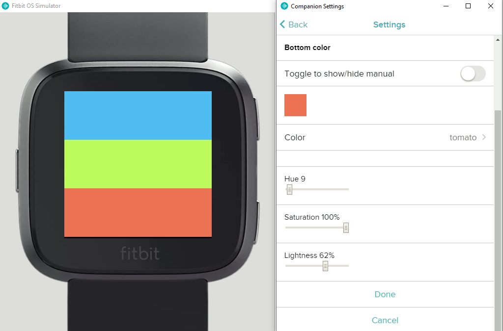

# fitbit-color-picker
Color Picker for Fitbit OS

This is a color picker component wrapped in a watch face for Fitbit devices. You can pick a custom color in the watch face settings.



Custom color picker component, which follows this idea:
1. Use slider elements to set HSL color values
2. Convert the HSL color to Hex color
3. Compute a base 64 encoded image based on the Hex color
4. Set the base 64 image as TextImageRow icon
5. Set the Hex color in settings

You can copy and run the whole project as a watch face in the Fitbit simulator.

To integrate the color picker in your watch face settings do this:
1. Copy this files or folders in your project:
- settings/colorpicker.jsx
- companion/lib/*
- companion/colorpicker.js
- common/colorpicker.js
2. Add code from companion/index.js to your project:
```  
  import * as cp from "./colorpicker";
  
  settingsStorage.onchange = evt => {
    if (cp.isColorPickerSetting(evt.key)) {
      cp.onchange(evt.key, settingsStorage);
      return;
    }
    // other code e.g. send settings to watch
  }
```
3. Add code from settings/index.jsx to your project:
```
import * as cp from "./colorpicker";
import * as cpConstants from "../common/colorpicker";
```
copy/alter and call getColorPickerSection function